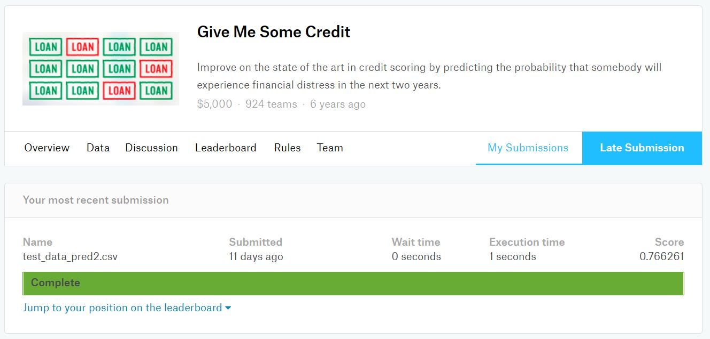
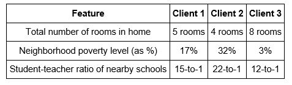

# Machine Learning Projects

## Kaggle 
- [x] [Give Me Some Credit](https://github.com/Sally-Ng/Kaggle_Give_Me_Some_Credit/tree/master)

 

## Udacity Machine Learning Nanodegree [(Link)](https://github.com/Sally-Ng/Udacity_Machine_Learning_Nanodegree) 

### Projects
- [x] [Project 1: Predicting Boston Housing Prices](https://github.com/Sally-Ng/MLND-Predicting_Boston_Housing_Prices)
- [ ] Project 2: Finding Donors for CharityML
- [ ] Project 3: Creating Customer Segments
- [ ] Project 4: Train a Smartcab to Drive
- [ ] Project 5: Dog Breed Classifier
- [ ] Project 6: Capstone Project

 
 

### Kaggle:
[Give Me Some Credit](https://github.com/Sally-Ng/Kaggle_Give_Me_Some_Credit/tree/master)  
Language: Python (scikit-learn, Matplotlib, pandas, NumPy)   
Skills: Machine Learning, Data Exploration, Data Visualization  
Built Supervised Machine Learning models to predicting the probability that somebody will experience 
financial distress in the next two years. Received a score of 0.77 and the winner of the competition had a score of 0.87.   

  

 

### Udacity Machine Learning Nanodegree:
[Project 1: Predicting Boston Housing Prices](https://github.com/Sally-Ng/MLND-Predicting_Boston_Housing_Prices)  
Language: Python (scikit-learn, pandas, NumPy)   
Skills: Machine Learning, Data Exploration  
Built Supervised Machine Learning model to estimate the best selling price of houses in Boston, Massachusetts. Distinguished the Decision Tree model preformed the best with a maximum depth of 4.   

  

